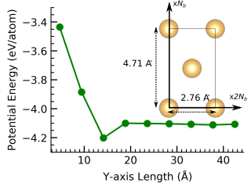
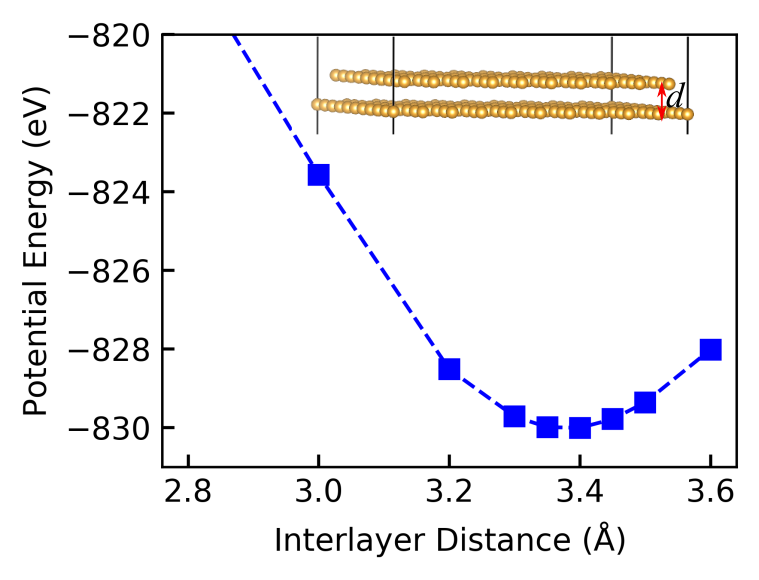

# GoldeneElasticityCalculations
This repository contains scripts and step-wise instructions for calculating Young's modulus and Poisson's ratio using strain-energy relations.

## _Energy calculator_
Hotbit was used to compute the potential energy of atomic configurations. For more details on its features, see [`Hotbit`](https://github.com/pekkosk/hotbit).  

### I. Hotbit's repulsive interaction term
For the Au-Au repulsive pairwise potential, we considered both the Au dimer and bulk systems.
The dimer data was obtained using the energy curve method and for a single Au2 dimer data when **σ = 0.5** and **σ = 1**.
For the bulk system, we used a single data point with **σ = 1**.  
Here, **σ** is inversely proportional to the weighting factor in the fitting process.  

**Note:** By navigating to `"hotbit/examples/AuAu_parametrization"` and editing the `"AuAu.py"` script, the new potential was generated.

The updated `Au_Au_repulsion.par`, which is compatible with goldene, has been uploaded to this repository.
To use the fitted potential, specify the path in the calculator as follows:

```python
 Hotbit(tables = {'AuAu': 'path-to-Au_Au_repulsion.par'},**other_params)
```
The computed lattice constant is **2.756 &#197;**, which is close to the **2.684 &#197;** obtained using the [PBEsol](https://www.vasp.at/wiki/index.php/GGA) functional implemented in [VASP](https://www.vasp.at/).
For comparison, the [experimentally measured](https://www.nature.com/articles/s44160-024-00518-4) value is **2.62 &#197;**. 

### II. Potential energy vs. cell size
To ensure that the calculations are not affected by the parameters of the **DFTB** method, we use a **conventional cell**.
Specifically, we select a **rectangular-shaped cell** for studying strain-energy relationships.  
We set $$N_b = 5$$ and $$N_a = 2 N_b = 10$$, resulting in a system containing **100 Au atoms**.
This configuration provides an energy accuracy of **2 meV/atom**.

<p align="center">
  
</p>

A rectangular conventional cell allows for the study of strain effects along different edges.

### III. Bilayer goldene interlayer distance
In a **goldene sheet**, Au atoms experience **strong metallic bonding** within the layers and **weak van der Waals interactions** between the layers.
We investigated the **interlayer distance dependence** of the **potential energy** in a **bilayer goldene system**.
The system is made of a **10×10×1 triclinic cell** containing **200 Au atoms**, with a **vacuum size of 30 &#197;**.  
Our calculations indicate that the **optimal interlayer distance** is **3.45 &#197;** (which represents the effective thickness of the layer).

<p align="center">
  
</p>

`We are now confident that the Hotbit parameters are well-configured for accurately calculating energy in what follows.`

## _Elasticity_
The **`ElasticityTheories.pdf`** file provides a detailed explanation of the **theory** and **computational steps** required to calculate the **elastic properties of 2D materials**.  
Below, we present a **hands-on example (goldene)** to demonstrate the process.

### I. Using `compute_starin_energy_variations.py`

The `compute_starin_energy_variations.py` script calculates energy variations for a range of applied strains. 

#### Important variables to set:
1. **`AXIS`**  
   - Defines the strain direction:  
     - `0` → x-direction  
     - `1` → y-direction  
     - `10` → xy-direction  

2. **`maximum_strain`**  
   - A float value representing the maximum strain applied.  
   - Typically, up to 20% strain may be considered, but this depends on the specific case.  
   - In our case, we apply up to **8% strain**. A list of strains from -0.08 (compressional) to 0.08 (tensile) with step of 0.01 is applied.

### II. Using `compute_elastic_constants.py`
The `compute_elastic_constants.py` script calculates the **second derivatives of energy variation** with respect to strain by fitting a **quadratic curve** to the data. 

1. `AXIS` is set the same as before.
2. Lattice information are manually set in the Python file.
3. The script reads **strain-energy data** from the `data/` directory.
4. A **quadratic function** is fitted to the data points.
5. The second derivative of this function is used to compute **elastic constants** (Look at the 'Goldene' Subsection of **`ElasticityTheories.pdf`**).

<p align="center">
  
</p>


